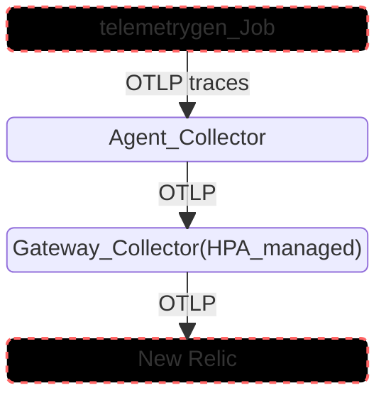

# Scaling OTel Collectors with Horizontal Pod Autoscaling

Demonstrates best practices for horizontally autoscaling an OpenTelemetry Collector gateway in Kubernetes, with a `telemetrygen`-based load generator that ramps traffic enough to trigger a real scale-up (and, once load stops, a scale-down).

Two deployment options, pick one:

| Option | Dir | Autoscaling mechanism | Requires |
|---|---|---|---|
| **OTel Operator** | [operator/](./operator) | `OpenTelemetryCollector.spec.autoscaler` — Operator generates the HPA for you | OTel Operator + cert-manager installed |
| **Standalone** | [standalone/](./standalone) | Plain `Deployment` + a hand-written `HorizontalPodAutoscaler` | Nothing beyond core Kubernetes |

Both produce the same Services (`agent-collector`, `gateway-collector`) in the `otel-scaling` namespace, so [loadgen-job.yaml](./loadgen-job.yaml) and the verification steps below work unchanged against either.

## Demo architecture



The **agent tier** is a fixed-size Collector deployment that just receives and forwards — the interesting part is the **gateway Collector**, which autoscales based on CPU/memory utilization as load increases.

## Prerequisites (both options)

### Confirm a Metrics Server is running

HPA requires the [Kubernetes Metrics Server](https://github.com/kubernetes-sigs/metrics-server). Managed clusters (GKE, AKS) usually have one; EKS and local clusters (kind, minikube) typically don't and need it installed manually:

```
kubectl get deployment metrics-server -n kube-system
```

If that returns nothing, install one:

```
kubectl apply -f https://github.com/kubernetes-sigs/metrics-server/releases/latest/download/components.yaml
```

On `kind` (and some other local clusters), the kubelet's cert isn't trusted by default, so metrics-server needs `--kubelet-insecure-tls` or it'll sit at `0/1` ready:

```
kubectl patch deployment metrics-server -n kube-system --type='json' \
  -p='[{"op":"add","path":"/spec/template/spec/containers/0/args/-","value":"--kubelet-insecure-tls"}]'
```

Without a working Metrics Server, the HPA object will exist but stay at `<unknown>` and never scale anything.

### Create the namespace and New Relic License Key Secret

```
kubectl create namespace otel-scaling
kubectl create secret generic newrelic-license-key --from-literal=licensekey=<YOUR NR LICENSE KEY> -n otel-scaling
```

(The `operator/agent-collector.yaml` manifest also creates the namespace itself, so this step is only strictly required for the standalone path — running it either way is harmless.)

Create the secret **before** deploying the gateway Collector below — if it's missing, the gateway pod fails to start with `CreateContainerConfigError: secret "newrelic-license-key" not found`. If you already applied the gateway manifest first, just create the secret now; the pod will restart on its own once it exists.

## Option A: OTel Operator

### Install Cert Manager

```
helm install \
  cert-manager jetstack/cert-manager \
  --namespace cert-manager \
  --create-namespace \
  --version v1.15.0 \
  --set crds.enabled=true
```

### Install Opentelemetry Operator

```
helm upgrade --install otel-operator open-telemetry/opentelemetry-operator \
  --set "manager.collectorImage.repository=otel/opentelemetry-collector-k8s" \
  --set admissionWebhooks.certManager.enabled=false \
  --set admissionWebhooks.autoGenerateCert.enabled=true \
  -n otel-scaling --create-namespace
```

### Deploy the collectors

```
kubectl apply -f operator/agent-collector.yaml
kubectl apply -f operator/gateway-collector.yaml
```

[operator/gateway-collector.yaml](./operator/gateway-collector.yaml) is the piece that matters for this demo. Autoscaling is a native field on the `OpenTelemetryCollector` CR — the Operator creates and manages the underlying `HorizontalPodAutoscaler` object for you, no separate HPA manifest required:

```yaml
resources:
  requests: { cpu: 100m, memory: 128Mi }
  limits: { cpu: 200m, memory: 256Mi }

autoscaler:
  minReplicas: 1
  maxReplicas: 5
  targetCPUUtilization: 50
  targetMemoryUtilization: 60
```

Confirm the Operator created the HPA:

```
kubectl get hpa -n otel-scaling
```

### Load balancing across scaled gateway pods

Scaling the gateway is only useful if the agent tier actually spreads traffic across the new pods. It won't by default: OTLP uses gRPC, which multiplexes many requests over one long-lived HTTP/2 connection, and a normal Kubernetes Service only load-balances at the connection level. Once an agent connects, every RPC on that connection keeps going to the same gateway pod — new pods the HPA adds just sit idle.

The fix is client-side gRPC load balancing. [operator/agent-collector.yaml](./operator/agent-collector.yaml) sets `balancer_name: round_robin` on the `otlp` exporter, and points it at `gateway-collector-headless.otel-scaling.svc:4317` — a separate headless `Service` defined at the bottom of [operator/gateway-collector.yaml](./operator/gateway-collector.yaml) (needed because the Operator's own auto-created `gateway-collector` Service is a normal ClusterIP, which DNS always resolves to a single VIP). A headless Service has no VIP: DNS returns every pod's IP directly, so the agent's gRPC client can see all of them and round-robin RPCs across them as the HPA scales.

If you already deployed the agent before this fix, restart it to pick up the new exporter config:

```
kubectl rollout restart deployment agent-collector -n otel-scaling
```

### Going further: custom-metric scaling

CPU/memory utilization is the easiest HPA signal to wire up, but it can be misleading for a Collector: it's possible for CPU to look idle while the export queue is backing up (a slow downstream, a network blip) and data is about to start dropping — CPU% alone won't surface that.

[operator/gateway-hpa-custom-metric.yaml](./operator/gateway-hpa-custom-metric.yaml) shows what scaling on a Collector-native signal looks like instead — e.g. `otelcol_exporter_queue_size` scraped via Prometheus and surfaced through `prometheus-adapter`. This needs real cluster infra (Prometheus + prometheus-adapter or KEDA) beyond this demo's prerequisites, so it isn't applied by default — see the comments in that file for what to wire up. If you do apply it, first remove `spec.autoscaler` from `gateway-collector.yaml` so the Operator's own generated HPA doesn't conflict with the hand-written one.

## Option B: Standalone (no Operator)

No CRDs, no admission webhooks, no cert-manager — just a `Deployment`, a `Service`, a `ConfigMap` holding the collector config, and a plain `HorizontalPodAutoscaler`.

```
kubectl apply -f standalone/namespace.yaml
kubectl apply -f standalone/agent-collector.yaml
kubectl apply -f standalone/gateway-collector.yaml
kubectl apply -f standalone/gateway-hpa.yaml
```

[standalone/gateway-hpa.yaml](./standalone/gateway-hpa.yaml) targets the raw `gateway-collector` Deployment directly, with the same `minReplicas`/`maxReplicas`/CPU/memory targets as the Operator path's `spec.autoscaler` block:

```yaml
spec:
  scaleTargetRef:
    apiVersion: apps/v1
    kind: Deployment
    name: gateway-collector
  minReplicas: 1
  maxReplicas: 5
  metrics:
    - type: Resource
      resource: { name: cpu, target: { type: Utilization, averageUtilization: 50 } }
    - type: Resource
      resource: { name: memory, target: { type: Utilization, averageUtilization: 60 } }
```

The Deployment's `resources.requests`/`limits` (in [standalone/gateway-collector.yaml](./standalone/gateway-collector.yaml)) are what the HPA computes utilization percentages against — same small values as the Operator path, for the same reason: a modest load is enough to trigger a visible scale-up.

Confirm the HPA is active:

```
kubectl get hpa -n otel-scaling
```

### Load balancing across scaled gateway pods

Scaling the gateway is only useful if the agent tier actually spreads traffic across the new pods. It won't by default: OTLP uses gRPC, which multiplexes many requests over one long-lived HTTP/2 connection, and a normal Kubernetes Service only load-balances at the connection level. Once an agent connects, every RPC on that connection keeps going to the same gateway pod — new pods the HPA adds just sit idle.

The fix is client-side gRPC load balancing: [standalone/agent-collector.yaml](./standalone/agent-collector.yaml) sets `balancer_name: round_robin` on the `otlp` exporter, and [standalone/gateway-collector.yaml](./standalone/gateway-collector.yaml)'s Service is headless (`clusterIP: None`). A headless Service has no VIP: DNS returns every pod's IP directly, so the agent's gRPC client can see all of them and round-robin RPCs across them as the HPA scales.

If you deployed the gateway Service before this fix, `kubectl apply` won't be enough — `clusterIP` can't be changed on an existing Service, so it needs to be replaced:

```
kubectl delete service gateway-collector -n otel-scaling
kubectl apply -f standalone/gateway-collector.yaml
kubectl rollout restart deployment agent-collector -n otel-scaling
```

## Trigger a scaling event

[loadgen-job.yaml](./loadgen-job.yaml) runs `telemetrygen` (OpenTelemetry's own load-generation CLI) through three stages of increasing rate — 5, then 50, then 200 spans/sec — sent as OTLP traces into the agent tier:

```
kubectl apply -f loadgen-job.yaml
```

Watch it scale, in two terminals:

```
kubectl get hpa -n otel-scaling -w
kubectl get pods -n otel-scaling -w
```

Expect output similar to:

```
NAME                REFERENCE                     TARGETS                        MINPODS   MAXPODS   REPLICAS   AGE
gateway-collector   Deployment/gateway-collector  cpu: 71%/50%, memory: 40%/60%   1         5         3          4m
```

(With the Operator option, `REFERENCE` reads `OpenTelemetryCollector/gateway` instead — everything else is the same.)

## Scale-down

Once the `telemetrygen-ramp` Job finishes and traffic drops back to zero, the HPA's default stabilization window (5 minutes) will bring the gateway back down toward `minReplicas`. Keep the `kubectl get hpa -w` terminal open to watch it happen — no manual action needed.

## Troubleshooting

**Agent logs `connection refused` or `i/o timeout` dialing the gateway, even though gateway pods are `Running`.** Recent `otelcol-contrib` images bind the `otlp` receiver to `127.0.0.1` by default when no `endpoint` is set under `grpc`/`http` — reachable inside the container, but not from any other pod. Both `agent-collector.yaml` and `gateway-collector.yaml` set `endpoint: 0.0.0.0:4317` / `0.0.0.0:4318` explicitly on the `otlp` receiver for this reason; if you're adapting these manifests and hit this, check that the receiver config wasn't simplified back to `grpc: {}` / `http: {}`.

**Pod stuck in `CreateContainerConfigError`.** The `newrelic-license-key` secret doesn't exist yet in `otel-scaling` — see the Prerequisites section above. The pod recovers on its own once the secret is created, no restart needed.

**`kubectl apply` on the gateway Service errors with `spec.clusterIPs[0]: Invalid value: ["None"]: may not change once set`.** You applied a normal `ClusterIP` Service before the headless-Service fix (see "Load balancing across scaled gateway pods" above) — `clusterIP` can't be changed on an existing Service. Delete and reapply:

```
kubectl delete service gateway-collector -n otel-scaling
kubectl apply -f standalone/gateway-collector.yaml
kubectl rollout restart deployment agent-collector -n otel-scaling
```

## Verify in New Relic

Traces from the loadgen run should be queryable within a couple minutes:

```
FROM Span SELECT count(*) WHERE service.name = 'telemetrygen' SINCE 15 minutes ago TIMESERIES
```

### Visualize the load balancing

The gateway Collector stamps every span with a `k8s.pod.name` resource attribute set to its own pod name (see the `resource` processor in `gateway-collector.yaml`) — this is what proves traffic is actually being spread across replicas as the HPA scales, not just pinned to whichever pod handled the first connection.

Facet by it to see the spread across gateway pods over time:

```
FROM Span SELECT count(*) WHERE service.name = 'telemetrygen' FACET k8s.pod.name SINCE 30 minutes ago TIMESERIES
```

A healthy scale-out looks like: one pod carrying all the traffic at first, then new `k8s.pod.name` values appearing and taking a growing share as the HPA adds replicas, and the count flattening out per-pod once load balancing kicks in.
