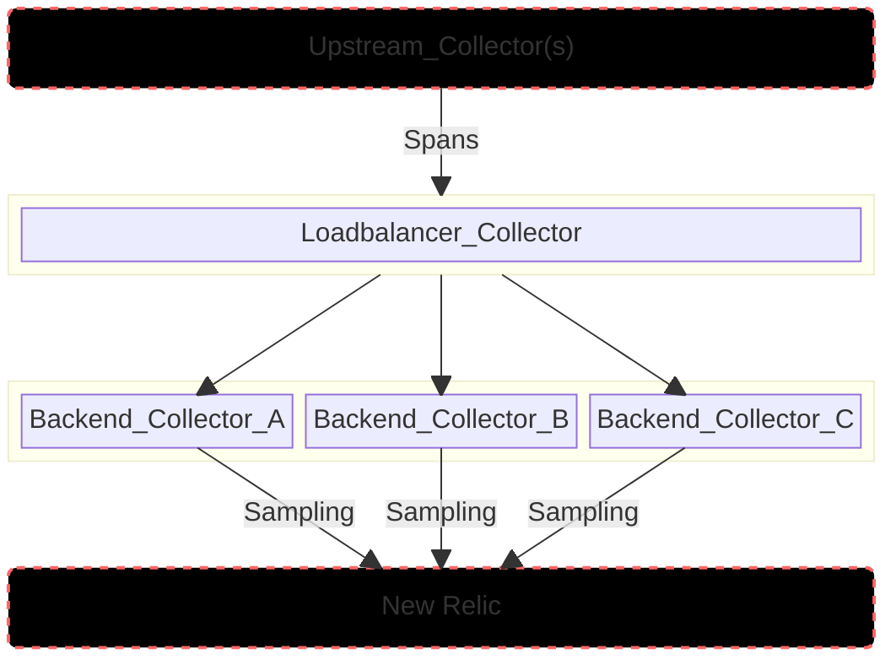

# Tail-based Sampling Example

This is based on the K8s Resolver [example](https://github.com/open-telemetry/opentelemetry-collector-contrib/blob/main/exporter/loadbalancingexporter/example/k8s-resolver/README.md) in the [opentelemetry-collector-contrib](https://github.com/open-telemetry/opentelemetry-collector-contrib) repo.

## Demo architecture



## Prerequisites

### Install Cert Manager
```
helm install \
  cert-manager jetstack/cert-manager \
  --namespace cert-manager \
  --create-namespace \
  --version v1.15.0 \
  --set crds.enabled=true
```

### Install Opentelemetry Operator
```
helm upgrade --install otel-operator open-telemetry/opentelemetry-operator \
  --set "manager.collectorImage.repository=otel/opentelemetry-collector-k8s" \
  --set admissionWebhooks.certManager.enabled=false \
  --set admissionWebhooks.autoGenerateCert.enabled=true \
  -n test --create-namespace
```

### Create New Relic License Key Secret

```
kubectl create secret generic newrelic-license-key --from-literal=licensekey=<YOUR NR LICENSE KEY> -n test
```

## Loadbalancer and Gateway config

Set up the load balancer and collector gateway.

```
kubectl apply -f loadbalancing.yaml -n test
```

The current config in [loadbalancing.yaml](./loadbalancing.yaml) is set up to only send traces containing errors but could easily be modified to behave differently.

```
...
processors:
  tail_sampling:
    decision_wait: 10s
    num_traces: 1000
    expected_new_traces_per_sec: 10
    policies:
      [
        {
          name: errors-policy,
          type: status_code,
          status_code: { status_codes: [ERROR] },
        },
        # {
        #   name: randomized-policy,
        #   type: probabilistic,
        #   probabilistic: { sampling_percentage: 25 },
        # },
      ]
...
```

## Upstream collector config

From your upstream collector(s), define an otlp exporter to ship traces to the `loadbalancer-collector`.

```
...

exporters:
  otlp/traces:
  endpoint: "http://loadbalancer-collector.test.svc:4317"
  tls:
    insecure: true
  otlp:
    endpoint: "otlp.nr-data.net:4317"
    tls:
      insecure: false
    headers:
      api-key: ${NEW_RELIC_LICENSE_KEY}

...

pipelines:
  traces:
    receivers: [otlp]
    processors: [memory_limiter, resource, resourcedetection, k8sattributes, batch]
    exporters: [spanmetrics, otlp/traces, debug]

...
```