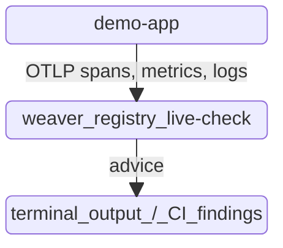

# Semantic Convention Linting with OTel Weaver

Demonstrates [OpenTelemetry Weaver](https://github.com/open-telemetry/weaver) validating real telemetry against a semantic-convention registry: as a local dev-loop tool (`live-check`), as a GitHub Action on every pull request, and as a New Relic scorecard over continuously-flowing telemetry.

One registry, one app:

| Piece | Where | What it does |
|---|---|---|
| Registry | [model/](./model) | Defines the `order.*` attributes, the `orders.checkout` span, the `orders.checkout.count` metric and the `orders.checkout.failed` event |
| Advice policies | [policies/](./policies) | Rego rules that make live-check flag out-of-enum values and unknown span names as violations |
| Demo app | [demo-app/](./demo-app) | `--mode live-check` sends a small compliant and non-compliant sample to weaver; `--mode demo` runs forever and sends realistic telemetry to New Relic |
| Scorecard | [demo-app/scorecard/](./demo-app/scorecard) | NRQL rules that measure registry compliance in New Relic |

The registry never changes and is always valid: `weaver registry check` passes on it regardless. What changes is whether the *instrumentation* follows it, which is what `weaver registry live-check` is for.

## Demo architecture



`live-check` starts an OTLP gRPC listener and streams every span, metric and log it receives against `model/`, printing findings as they arrive. No collector, no backend, no waiting.

## Prerequisites

Install Weaver from the [releases](https://github.com/open-telemetry/weaver/releases) page (or `docker pull otel/weaver`), then confirm with `weaver --version`.

```
python3 -m venv .venv
source .venv/bin/activate
pip install -r demo-app/requirements.txt
```

## The registry

[model/orders.yaml](./model/orders.yaml) defines the `order.*` attributes (`order.id`, `order.total`, `order.currency`, `order.payment_method`, `order.item_count`), the `orders.checkout` span, the `orders.checkout.count` counter keyed by `order.currency`, and the `orders.checkout.failed` event. `order.currency` and `order.payment_method` are enums: a registry can only judge a *value* if it lists the valid ones. [model/manifest.yaml](./model/manifest.yaml) depends on the upstream `open-telemetry/semantic-conventions` registry, which makes `service.name`, `telemetry.sdk.*` and `error.type` resolvable too.

`.weaver.toml` sets `model` as the default registry and loads the advice policies, so the commands below need no flags. Run them from this directory, because the paths are relative. Weaver prints "Experimental!" for that config file; that is expected.

## Run live-check locally

Start the listener:

```
weaver registry live-check --inactivity-timeout 30
```

In another terminal, send only compliant telemetry:

```
python3 demo-app/app.py --mode live-check --compliant-only
```

The only finding is an `improvement` note that `order.item_count` is `stability: development`. Zero violations.

Now send everything, non-compliant samples included, to a fresh listener:

```
python3 demo-app/app.py --mode live-check
```

| Mistake | Finding |
|---|---|
| `order.total` sent as a string | `violation`: type should be `double` |
| `order.currency` sent as an int on the metric | `violation`: not one of the enum values |
| `order.id` omitted (required on `orders.checkout`) | `missing_attribute`, counted in the end-of-run summary |
| Stray `orderId` attribute | `violation`: does not exist in the registry |
| `order.currency = "jpy"` | `violation`: not one of `CAD, EUR, GBP, JPY, USD` (policy) |
| `order.payment_method = "bitcoin"` | `violation`: not one of the enum values (policy) |
| Span named `order.checkout` | `violation`: span name not defined in the registry (policy) |

Weaver's built-in advice only reports undocumented enum values at `information` level and doesn't check span names, so [policies/orders.rego](./policies/orders.rego) escalates both. Loading custom advice policies replaces part of weaver's defaults: the "missing namespace" and name-format findings for `orderId` no longer appear, but the type, unknown-attribute and stability checks still run.

## Always-on demo and scorecard

See [demo-app/README.md](./demo-app/README.md) for demo mode, Docker and Kubernetes deployment, and the New Relic scorecard.

## CI: Weaver on every pull request

[.github/workflows/weaver-semconv-check.yml](../.github/workflows/weaver-semconv-check.yml) runs on any PR touching this demo:

1. `weaver registry check -r weaver/model` validates the registry YAML itself.
2. Starts a live-check listener via `weaver-live-check-start`, using [ci.weaver.toml](./ci.weaver.toml) for the advice policies, runs `demo-app --mode live-check --compliant-only` against it, then stops it via `weaver-live-check-stop` with `fail-on: violation`. A regression in the compliant instrumentation fails the PR.

`ci.weaver.toml` repeats the settings in `.weaver.toml` with repo-root-relative paths, since the job runs from the repo root. Keep the two in sync.

The non-compliant samples are never run in CI; they exist to show what a violation looks like locally.

The structure mirrors [opentelemetry-weaver-examples](https://github.com/open-telemetry/opentelemetry-weaver-examples)' own CI.

## Troubleshooting

**`weaver: command not found`**: confirm the install completed and your shell picked up the new `PATH` entry.

**`Invalid policy path 'policies/data'`**: run weaver from this directory, or pass `--config` pointing at a file with paths relative to where you are.

**Live-check exits with `Address already in use`**: a previous session still holds port `4317` (or `4320` for the admin port). Find it with `lsof -i :4317` and `kill <pid>`, or `curl -X POST http://localhost:4320/stop`.

**The app hangs for a few seconds, then prints connection errors**: no listener is running yet; the OTLP exporter retries with backoff. Start `weaver registry live-check` first.
